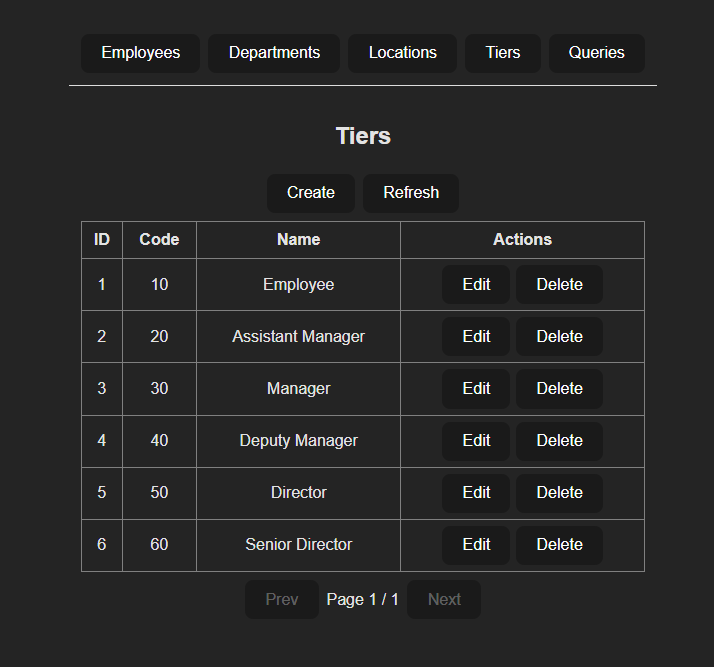

# Ops Candidate Evaluation — Fullstack App (React JS + Spring Boot)

This repository contains a sample candidate evaluation project using React (Vite + TypeScript) for the frontend and Spring Boot (Java + Spring Data/JdbcTemplate) for the backend. It includes data import helpers, raw SQL query endpoints, API call logging, and a minimal CRUD UI.

Repository layout

- backend/
  - src/main/java/... — Spring Boot app, entities, repositories, services, controllers
  - src/main/resources/application.properties — DB and app properties
  - src/main/resources/db/schema.sql — PostgreSQL DDL (BIGSERIAL)
  - src/main/resources/\* — other resources (import runner reads sample-project)
  - mvnw / pom.xml — build and dependencies
- ops-candidate-evaluation-frontend/
  - src/ — React + TypeScript UI, API client, CRUD pages, Query page
  - .env.local — Vite client environment (VITE_API_BASE_URL)
- sample-project/
  - department.xlsx, employee.xlsx, location.xlsx, tier.xlsx — provided data files
- screenshots/
  - (successful import)

Quickstart — Backend (Windows PowerShell)

1. Ensure prerequisites:
   - Java 21
   - PostgreSQL running
2. Create database (adjust user/password/DB name):

```powershell
$env:PGPASSWORD="your_db_password"
psql -h localhost -U postgres -c "CREATE DATABASE ops_evaluation;"
```

3. Place sample Excel files where the import runner expects (default):

   - F:\ops-candidate-evalutation\sample-project
     Or set `app.import.path` as shown below.

4. Configure connection (edit backend/src/main/resources/application.properties or pass via -D):

```properties
spring.datasource.url=jdbc:postgresql://localhost:5432/ops_evaluation
spring.datasource.username=postgres
spring.datasource.password=your_db_password
spring.jpa.hibernate.ddl-auto=update
app.import.path=F:/ops-candidate-evalutation/sample-project
```

5. Run backend (Maven wrapper):

```powershell
cd F:\ops-candidate-evalutation\backend
.\mvnw.cmd spring-boot:run
# or build jar
.\mvnw.cmd clean package
java -Dspring.datasource.url="jdbc:postgresql://localhost:5432/ops_evaluation" `
     -Dspring.datasource.username=postgres `
     -Dspring.datasource.password=your_db_password `
     -Dapp.import.path="F:/ops-candidate-evalutation/sample-project" -jar target\*.jar
```

Notes:

- The app includes a CommandLineRunner importer that reads the XLSX files and inserts into tables.
- If you prefer to run DDL manually, execute:

```powershell
psql -h localhost -U postgres -d ops_evaluation -f "F:\ops-candidate-evalutation\backend\src\main\resources\db\schema.sql"
```

CORS and API

- Backend exposes REST endpoints under `/api/*`. Example resources:
  - GET/POST/PUT/DELETE /api/employee
  - GET/POST/PUT/DELETE /api/department
  - GET/POST/PUT/DELETE /api/location
  - GET/POST/PUT/DELETE /api/tier
- Complex queries:
  - GET /api/query/q1
  - GET /api/query/q2
  - GET /api/query/q3
- The app logs every API call to `api_call_history`.

If you run the frontend dev server (Vite) at http://localhost:5173, the backend config includes CORS mapping allowing that origin by default. For production, restrict origins.

Quickstart — Frontend (Windows PowerShell)

1. Ensure Node.js (16+) installed.
2. Set client env (Vite reads .env.local):

```text
# ops-candidate-evaluation-frontend/.env.local
VITE_API_BASE_URL=http://localhost:8080
```

3. Start dev server:

```powershell
cd F:\ops-candidate-evalutation\ops-candidate-evaluation-frontend
npm install
npm run dev
# Open http://localhost:5173
```

Frontend notes

- API client uses VITE_API_BASE_URL to build requests to backend.
- CRUD pages for employee/department/location/tier are in `src/pages/*`.
- Query page calls `/api/query/q1|q2|q3` and renders results.

Troubleshooting

- Error: "database ... does not exist" → create the DB or fix `spring.datasource.url`.
- Error: CORS blocked from origin → ensure backend `WebConfig.addCorsMappings` includes the Vite origin or use `@CrossOrigin` on controllers.
- If you see HTML ("Unexpected token '<'") when fetching JSON — the request reached the frontend dev server (proxy/missing base URL). Confirm `VITE_API_BASE_URL` and restart Vite.

Files of interest (high level)

- backend:
  - BackendApplication.java (main)
  - model/\*.java (entities: Employee, Department, Location, Tier, ApiCallHistory)
  - repository/\*.java
  - service/\*.java
  - controller/\*.java (CRUD controllers + QueryController)
  - config/ApiLoggingInterceptor.java, WebConfig.java, GlobalExceptionHandler.java
  - importer/DataImportRunner.java
- frontend:
  - src/api.ts (typed API client)
  - src/types.ts (TS types for backend models)
  - src/components/CrudPage.tsx (generic CRUD UI, typed)
  - src/pages/\* (EmployeePage, DepartmentPage, LocationPage, TierPage, QueryPage)
  - .env.local (VITE_API_BASE_URL)

Screenshots

- Frontend list view with data :

  1. Employee

  

  2.  Department

  

  3. Location

  

  4. Complex Query SQL Data

  

  5. Tier

  

Contribution and notes

- This repo is a candidate evaluation sample. It intentionally uses plain SQL for complex queries (no window functions).
- For production hardening: restrict CORS, add authentication, validate inputs, enable structured logging and monitoring, and move sensitive settings to secret store.
