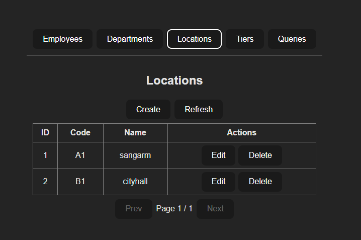

# Ops Candidate Evaluation — Fullstack

One-file README combining backend, frontend, Docker, CI and API usage.

---

## Summary

Fullstack App - Demo Candidate Evaluation :

- Backend: Spring Boot (Maven, Java 21)
- Frontend: React + Vite + TypeScript
- DB: PostgreSQL (Docker or local)
- Features: XLSX data import runner, CRUD APIs, complex SQL query endpoints, Swagger (OpenAPI), frontend responsive UI, unit tests (Vitest), CI and automated releases

Repository layout

- `backend/` — Spring Boot app (Maven)
- `ops-candidate-evaluation-frontend/` — Vite + React frontend
- `sample-project/` — sample import XLSX files
- `screenshots/` — UI / import screenshots (add images here)
- `docker-compose.yml` — docker-compose to run db + backend + frontend
- `.github/workflows/` — CI and release workflows
- `package.json`, `.releaserc.json` (root) — semantic-release config

---

## Prerequisites (local)

- Docker Desktop (recommended)
- Node.js >= 20.8.1 (dev + semantic-release)
- Java 17+ / 21 (for local backend dev) and Maven (optional, wrapper included)
- PostgreSQL (if you don't use Docker)

---

## Quick start (Docker, recommended)

From repo root in PowerShell or bash:

1. Build & start:
   npm run docker:up

   # or

   docker compose up -d --build

2. Check status / logs:
   npm run docker:ps
   npm run docker:logs:backend
   npm run docker:logs:frontend

3. Open apps:

- Frontend UI: http://localhost:5173
- Backend API: http://localhost:8080/api
- Swagger UI: http://localhost:8080/swagger-ui/index.html
- OpenAPI JSON: http://localhost:8080/v3/api-docs

4. Stop & remove:
   npm run docker:down
   # or
   docker compose down -v

Notes:

- `docker-compose.yml` mounts `./sample-project` into the backend container at `/import/sample-project` and sets `APP_IMPORT_PATH` so the automatic importer can read sample files.
- Frontend built image serves static files via nginx. Built UI uses `VITE_API_BASE_URL=/api` by default and nginx proxies `/api` to the backend service.

---

## Importing your DB dump (`ops-evaluation.sql`)

If `ops-evaluation.sql` is a plain SQL dump (placed at repo root), you can import it into the running Postgres container or into a local Postgres instance.

1. Import into running Docker Postgres container:

```powershell
# replace <pg-service-name> with the container name from `docker compose ps`, commonly "opscandidateevalutation_db_1" or "db"
docker compose ps
# import from host into container
cat ops-evaluation.sql | docker compose exec -T db psql -U postgres -d ops_evaluation
```

2. Import directly into local Postgres (host machine):

```powershell
# ensure database exists
psql -U postgres -c "CREATE DATABASE ops_evaluation;"
# import
psql -U postgres -d ops_evaluation -f ops-evaluation.sql
```

3. Use provided script (if present)

- Bash (Linux/WSL/macOS): `scripts/pg/import_db.sh ops-evaluation.sql` (set PGHOST/PGUSER/PGPASSWORD env vars)
- PowerShell: `.\scripts\pg\import_db.ps1 -File .\ops-evaluation.sql -Host localhost -User postgres -Password yourpw -Database ops_evaluation`

Notes:

- If dump is custom format (`.dump`), use `pg_restore` instead of `psql`.
- If docker Postgres is not named `db` in compose file, substitute the service name.

# Indexes and query tuning (Postgres)

This document describes the indexes recommended for the backend raw-SQL queries (q1, q2, q3), how to apply them, how to verify they are used, and important caveats.

## Why add indexes

- Reduce full-table scans for large `employee` table.
- Enable index-range scans for the cumulative-sum pattern (q1) and accelerate group/filter operations used by q2/q3.
- Indexes help reads; they add storage and slow writes (INSERT/UPDATE/DELETE).

## Recommended indexes

Create these indexes on your PostgreSQL database. Adjust column names/types if your schema differs.

Option A — non-blocking (production, may require manual checks):

- Use `CONCURRENTLY` to avoid long table locks. Note: `CREATE INDEX CONCURRENTLY` cannot run inside a transaction.

```sql
CREATE INDEX CONCURRENTLY idx_employee_dept_empno
  ON employee(dept_code, emp_no);

CREATE INDEX CONCURRENTLY idx_employee_location_dept_salary
  ON employee(location_id, dept_code, salary);

CREATE INDEX CONCURRENTLY idx_employee_location
  ON employee(location_id);

CREATE INDEX CONCURRENTLY idx_department_code
  ON department(code);
```

Option B — simple (may lock table briefly):

```sql
CREATE INDEX IF NOT EXISTS idx_employee_dept_empno
  ON employee(dept_code, emp_no);

CREATE INDEX IF NOT EXISTS idx_employee_location_dept_salary
  ON employee(location_id, dept_code, salary);

CREATE INDEX IF NOT EXISTS idx_employee_location
  ON employee(location_id);

CREATE INDEX IF NOT EXISTS idx_department_code
  ON department(code);
```

## Flyway migration (recommended)

Place a migration file so indexes are created automatically for new deployments.

Example migration file:

```sql
-- filepath: backend/src/main/resources/db/migration/V2__add_employee_indexes.sql
-- Use CONCURRENTLY only if your Flyway config runs this migration outside a transaction.
CREATE INDEX IF NOT EXISTS idx_employee_dept_empno
  ON employee(dept_code, emp_no);

CREATE INDEX IF NOT EXISTS idx_employee_location_dept_salary
  ON employee(location_id, dept_code, salary);

CREATE INDEX IF NOT EXISTS idx_employee_location
  ON employee(location_id);

CREATE INDEX IF NOT EXISTS idx_department_code
  ON department(code);
```

Notes:

- Flyway runs migrations inside transactions by default for Postgres. If you want `CONCURRENTLY`, configure Flyway to run that migration without a transaction or create the index manually.

## Apply manually (Windows PowerShell + psql)

Save SQL to `create_indexes.sql` and run:

```powershell
psql -h <host> -U <user> -d <dbname> -f "C:\path\to\create_indexes.sql"
```

Or run single command:

```powershell
psql -h <host> -U <user> -d <dbname> -c "CREATE INDEX IF NOT EXISTS idx_employee_dept_empno ON employee(dept_code, emp_no);"
```

## After creating indexes

1. Refresh planner statistics:

```sql
ANALYZE employee;
ANALYZE department;
```

2. Verify indexes exist:

```sql
SELECT indexname, indexdef FROM pg_indexes WHERE tablename = 'employee' OR tablename = 'department';
-- OR in psql interactive:
\di
```

3. Run EXPLAIN (ANALYZE, BUFFERS, VERBOSE) on the exact query strings for q1, q2, q3 to confirm index usage.

Example EXPLAIN for q1 (equality variant):

```sql
EXPLAIN (ANALYZE, BUFFERS, VERBOSE)
SELECT e.dept_code, e.emp_no, e.name,
  (SELECT SUM(b.salary) FROM employee b WHERE b.dept_code = e.dept_code AND b.emp_no <= e.emp_no) AS cumulative_salary
FROM employee e
ORDER BY e.dept_code, e.emp_no;
```

Look for `Index Scan` or `Index Only Scan` on the inner lookup (the `b` side). If you see `Seq Scan`, check types/stats/size.

## Common issues and quick fixes

- Type mismatch: implicit casts prevent index use. Verify with:

```sql
SELECT column_name, data_type
FROM information_schema.columns
WHERE table_name='employee' AND column_name IN ('dept_code','emp_no','salary');
```

If types differ (e.g. dept_code integer vs text), either:

- normalize schema, or
- create an index on the cast expression (e.g. ON ((dept_code::text), emp_no)).

- NULL semantics: `IS NOT DISTINCT FROM` and certain expressions may prevent index-range scans. For best index usage prefer equality and handle NULLs explicitly (two-branch LATERAL or small scan for NULL-key rows).

- Table small: planner chooses sequential scan for small tables — indexes matter on larger datasets.

- CONCURRENTLY caveat: `CREATE INDEX CONCURRENTLY` cannot run inside transactions (Flyway default). Run separately or adjust Flyway settings.

## When to use partial or expression indexes

If many rows have NULL keys or common filters, consider partial indexes:

```sql
CREATE INDEX CONCURRENTLY idx_employee_loc_dept_salary_nonnull
  ON employee(location_id, dept_code, salary)
  WHERE location_id IS NOT NULL;
```

Or expression indexes if casts are frequent:

```sql
CREATE INDEX CONCURRENTLY idx_employee_dept_text_empno
  ON employee((dept_code::text), emp_no);
```

## Verification / next steps

- Run EXPLAIN for each query and paste the output if you want help interpreting it.
- If planner still uses seq scans, include:
  - EXPLAIN output,
  - results of `SELECT indexdef FROM pg_indexes WHERE tablename='employee';`
  - `information_schema.columns` types for `dept_code` and `emp_no`.

## TL;DR

- Create indexes that match your query predicates and ordering.
- Refresh stats (ANALYZE).
- Verify with EXPLAIN.
- Adjust index shape or query if EXPLAIN shows seq scan.

## Local development

Backend (Windows PowerShell)

1. Edit `backend/src/main/resources/application.properties` or pass properties at runtime.
2. Run:

```powershell
cd backend
# run with Maven wrapper
mvnw.cmd spring-boot:run
# package
mvnw.cmd clean package
```

3. Build jar:

```powershell
   .\mvnw.cmd clean package
java -Dspring.datasource.url="jdbc:postgresql://localhost:5432/ops_evaluation" `
     -Dspring.datasource.username=postgres `
     -Dspring.datasource.password=your_pw -jar target\*.jar
```

Frontend (Windows PowerShell)

1. Ensure Node.js (16+) installed.
2. Set client env (Vite reads .env.local):
   ```text
   # ops-candidate-evaluation-frontend/.env.local
   VITE_API_BASE_URL=http://localhost:8080
   ```
3. Start dev server:
   ```powershell
   cd F:\ops-candidate-evalutation\ops-candidate-evaluation-frontend
   npm install
   npm run dev
   # Open http://localhost:5173
   ```

---

## Tests

Frontend (Vitest)

```powershell
cd ops-candidate-evaluation-frontend
npm install
npm run test
# interactive UI
npm run test:ui
```

## Swagger / OpenAPI

- Springdoc is configured in backend; UI available at:
  - Swagger UI: http://localhost:8080/swagger-ui/index.html
  - Raw Spec: http://localhost:8080/v3/api-docs
- If /v3/api-docs returns 500, check backend logs for springdoc / Spring version mismatch. Use the springdoc starter version compatible with your Spring Boot.

---

## CORS

Global CORS is configured in `backend/src/main/java/.../config/WebConfig.java`. For local dev with Vite:

- Ensure `VITE_API_BASE_URL` is set to `http://localhost:8080` or use `/api` when using nginx proxy.
- If CORS fails, confirm `allowedOriginPatterns` includes `http://localhost:*` and that the interceptor allows OPTIONS.

---

## Docker build/run commands (npm scripts)

`npm run docker:up -> docker compose up -d --build`
`npm run docker:down -> docker compose down -v`
`npm run docker:build -> docker compose build --no-cache`
`npm run docker:logs -> tail all logs`
`npm run docker:logs:backend -> tail backend logs`

## Environment configuration (key variables)

1. Backend

```powershell
SPRING_DATASOURCE_URL — JDBC URL (e.g. jdbc:postgresql://db:5432/ops_evaluation)
SPRING_DATASOURCE_USERNAME — DB user
SPRING_DATASOURCE_PASSWORD — DB password
APP_IMPORT_PATH — path to sample files inside container (default /import/sample-project)
APP_IMPORT_ENABLED — toggle automatic import runner ("true"/"false")
```

2. Frontend

```powershell
VITE_API_BASE_URL — API base URL used by frontend at build time
For dev: http://localhost:8080
For production container build: /api (so nginx can proxy)
```

3. CI / Release

```powershell
GITHUB_TOKEN (or PERSONAL_TOKEN) must be configured in repo secrets for semantic-release and push permissions.
```

## API — endpoints & examples

Base URL: `http://localhost:8080` (or container backend service)

CRUD resources (JSON)

- Employees

`GET /api/employee -> list employees`
`GET /api/employee/{id} -> get by id`
`POST /api/employee -> create (JSON body)`
`PUT /api/employee/{id} -> update (JSON body)`
`DELETE /api/employee/{id} -> delete`

- Departments

`GET /api/department`
`GET /api/department/{id}`
`POST /api/department`
`PUT /api/department/{id}`
`DELETE /api/department/{id}`

- Locations

`GET /api/location`
`GET /api/location/{id}`
`POST /api/location`
`PUT /api/location/{id}`
`DELETE /api/location/{id}`

- Tiers

  `GET /api/tier`
  `GET /api/tier/{id}`
  `POST /api/tier`
  `PUT /api/tier/{id}`
  `DELETE /api/tier/{id}`

- Complex query endpoints (return list of objects)

  `GET /api/query/q1 -> cumulative salary per employee (per dept)`
  `GET /api/query/q2 -> department analysis by location`
  `GET /api/query/q3 -> salary ranking & gap`

- Health / Actuator (if enabled)

  `GET /actuator/health`

- Examples (curl)

  1. List employees:

```powershell
curl -sS http://localhost:8080/api/employee | jq
```

2. Create employee (example):

```powershell
curl -sS -X POST http://localhost:8080/api/employee \
  -H "Content-Type: application/json" \
  -d '{
    "emp_no": "E123",
    "name": "Alice Example",
    "dept_code": "D01",
    "location_id": 1,
    "position": "Engineer",
    "salary": 65000
  }' | jq
```

3. Run query q1:

```powershell
  curl -sS http://localhost:8080/api/query/q1 | jq
```

If frontend is served at http://localhost:5173, and VITE_API_BASE_URL is set to /api in the built frontend + nginx proxy, browser requests will be relative (/api/...) and proxied to backend.

---

## Data import

- Put XLSX files into sample-project/ at repo root.
- Docker compose mounts that folder into backend at /import/sample-project and sets APP_IMPORT_PATH accordingly.
- The import runner reads the files and inserts data; control with APP_IMPORT_ENABLED.

## CI & Releases

- CI: .github/workflows/ci.yml builds backend and frontend, runs tests (uses Docker DB for backend tests).
- Releases: semantic-release configured at repo root:

1.  Requires Node >=20.8.1 on runner
2.  semantic-release will bump backend pom.xml and frontend package.json, commit and create a GitHub Release
3.  Ensure GITHUB_TOKEN / PERSONAL_TOKEN has repo write permissions and is configured in Actions

## Troubleshooting

- "Unexpected token '<'" when fetching JSON → request returned HTML (dev server index). Fix API base: set `VITE_API_BASE_URL` correctly or use relative /api.

- CORS errors → backend must enable CORS for Vite origin (`http://localhost:5173`) or use nginx proxy for built frontend.

- Browser fails to resolve hostname `backend` → this name exists only inside Docker network. Use localhost for host-based dev or build frontend with `/api` and let nginx proxy inside docker-compose.

- Frontend shows nginx `502 Bad Gateway` → nginx couldn't reach backend. Check `docker compose ps` and `docker compose logs backend`. Ensure backend is healthy and listening on `8080`.

- VS Code: `BackendApplication.java` is a non-project `file` → open the backend folder as a Maven project or import Java projects in VS Code and ensure pom.xml exists at `backend/pom.xml`.

- Maven tests fail due to import runner → disable runner during tests using `@Profile("!test")` on runner or set `app.import.enabled=false` in `src/test/resources/application.properties`.

---

Screenshots

- Frontend list view with data :

  1. Employee

  

  2.  Department

  

  3. Location

  

  4. Complex Query SQL Data

  

  5. Tier

  

---

## Contribution and notes

- This repo is a candidate evaluation sample. It intentionally uses plain SQL for complex queries (no window functions).
- For production hardening: restrict CORS, add authentication, validate inputs, enable structured logging and monitoring, and move sensitive settings to secret store.
